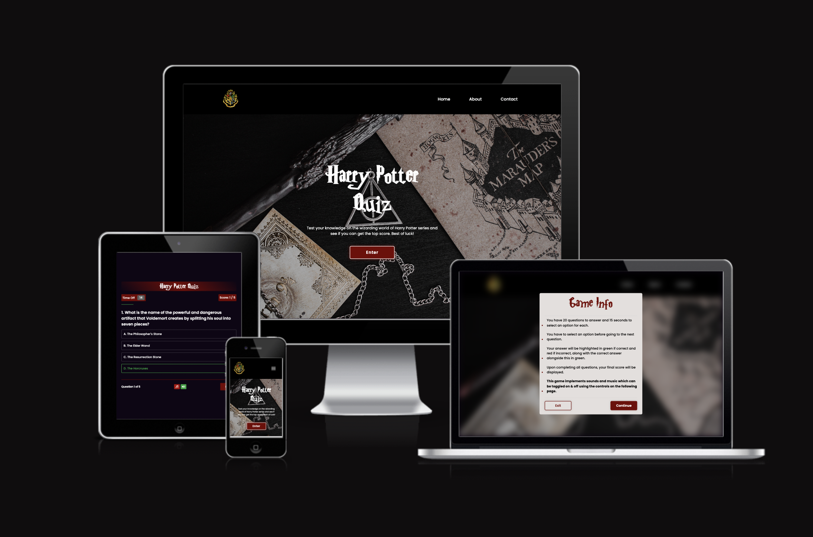
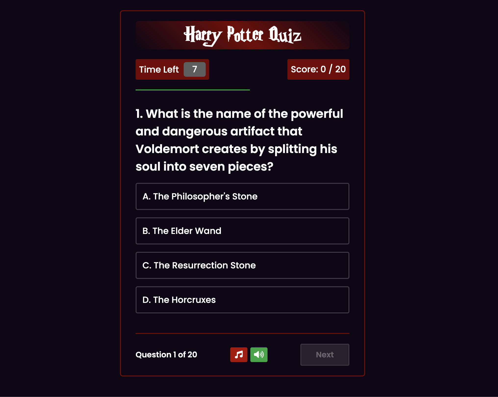
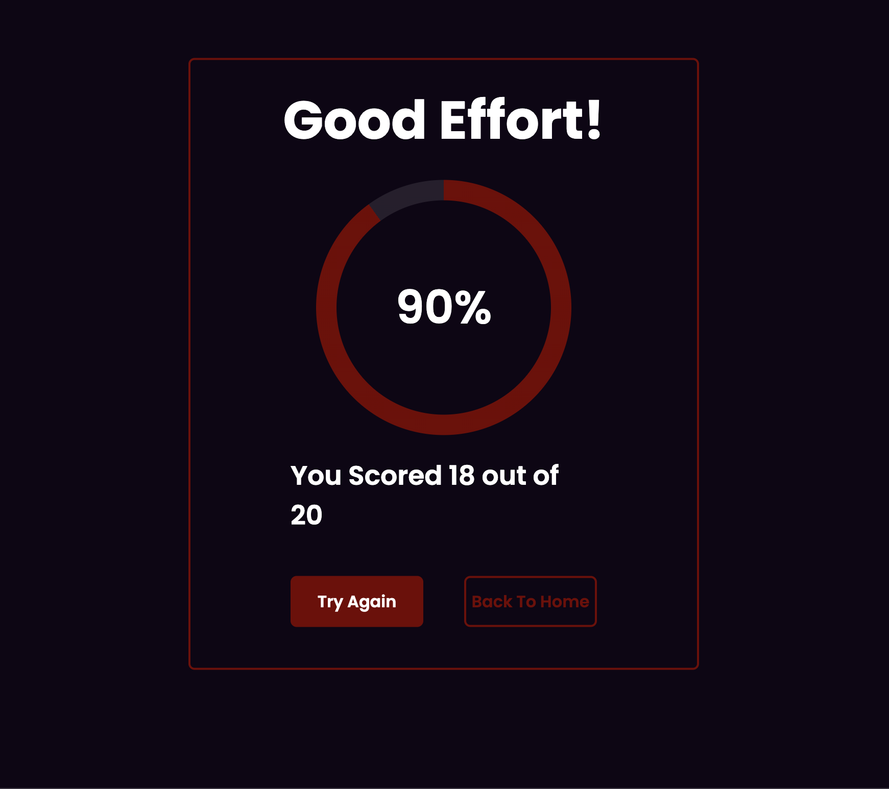
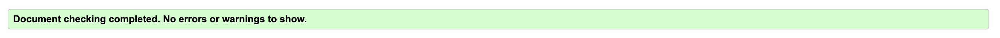

# Harry Potter Quiz

This project is a Harry Potter quiz made entirely with HTML, CSS and vanilla JavaScript. The quiz contains 20 questions and has full user interactivity including sounds, background music and a score tracking system. The aim of this project is for users to be able to test their knowledge and learn more about the Harry Potter universe. My target audience are people who enjoy the Harry Potter series as well as anybody who just likes to complete quizzes. This quiz is suitable for both adults and children. 

## Current Features

### Header/Navbar

- Navbar contains the site logo along with links to the home, about and contact pages.
- The navbar transforms into a custom hamburger menu when visiting the site from a mobile device.

### Home Screen

- The home screen contains a large title along with a brief overview and Harry Potter themed background, to make it immediately obvious to visitors what they can expect to find throughout the website.
- There is a large call to action button in an attempt to encourage site visitors to navigate through to the quiz and try it out for themselves.

### Home Popup

- Upon clicking the enter cta button, a popup appears providing important game information and instructions.
- From this popup, you can either continue through to immediately start the quiz or exit out back to the home screen.
- I added blur to the background of the popup, to ensure the user is not distracted by the background and to also improve the user interface.

### Quiz Section

- Smooth sideway transition from home screen
- Quiz header contains quiz title, timer, timeline and current score
- Main body contains the current question along with the 4 multiple choice options
- Quiz footer contains the question count, the sound controls along with the next button which becomes available only when an answer has been selected

### Audio

- Game implements sounds for selecting a correct or incorrect answer
- Also background music that plays when on the main quiz section
- Background music automatically starts but is muted by default for better ui.
- Sounds are on by default right now but soon to be changed to muted as per the background music.
- Music and sounds can be toggled on or off using the buttons at the bottom of the quiz box.
- Warning that the game contains sounds in the home screen popup to give users a fair warning and for better user experience.

### Timer & Timeline

- Timer automatically count down from 15 on each question.
- This is displayed in the quiz header so it is clear for the user
- If it reaches zero, the options are disabled and the correct answer is automatically highlighted(along with incorrect sound), indicating time has run out.
- If a user makes a choice within alloted time, the timer stops counting down and the text changes from 'time left' to 'time off'.
- Timeline gradually fills in across width of quiz box with the color green at the same pace the timer is going at.
- When option is selected, the timeline stops moving and resets after every question.
- When 3 seconds left on timer(timeline is so many px away from full length of quiz box) the color changes from green to red to indicate to user that theres very little time left and to present an imminent warning of them running out of time.
- Depending on what screen size the user is playing on, affects how fast the timeline progresses. The smaller the screen, the faster I had to make the timeline move.

### Result Section

- Interactive text which changes depending on your final score
- Circular progress bar. Shows users final score in a percentage which automatically fills up in the progress bar to match the percentage number displayed in the centre of this component.
- Also displays how many questions you answered correctly out of the total beneath the progress bar
- Try again and Back to home buttons redirect user to either play again or return to the home screen.

## Additional Features To Implement

### Choose A Difficulty

- I would like to include the ability for the user to choose from easy, medium and hard difficulties, along with a different set of quiz questions for each.

### Leaderboard

- The ability for a user to input their name and to have their quiz score saved on a leaderboard would be another feature that I would like to implement. This would be a good feature to allow users to compare their results with friends or even strangers.

### Different Question Types

- As well as just multiple choice questions, I would like to include ones where the user must input an answer manually and/or for there to be the ability to select more than one correct answer.

## Deployment

### Local Deployment

### Live Deployment

The points below outline the neceassary steps taken to deploy this project live through Github Pages.

- Navigate to your repository on Github.
- Select the settings tab and then select Pages from the dropdown on the left hand side.
- On this page you can enable Github Pages and select the branch you want to deploy from and click save.
- From here, you will be notifed that your project is live along with a link to the live web page.
- Any future changes to your code will now show on the live site also, since it is redeployed with each new commit.

## Testing

### Manual Testing

Extensive manual testing has been carried out throughout development by myself and also family and friends to document any bugs present in my code. Below are the manual tests that have been carried out:

- Tested and confirmed that the site works as expected on the following browsers: Chrome, Safari & Firefox.

- All code has been put through the appropriate validators.

- The site is responsive and works well on various different screen sizes. This has been tested in the development devices tool bar and on a number of different mobiles and tablets.

- Myself and others have played through the quiz dozens of times to ensure the score, timer, timeline and results page are all working and displaying the correct output.

- Console logging was used extensively throughout the development to ensure the code was functioning as expected and to also make any debugging easier.

- All links are working and open in a new tab when clicked.

- The sounds and background music work as expected and the audio buttons mute and unmute the audio successfully.

### Validator Testing

- All HTML passes through the HTML W3C Validator with no errors.

    

- All CSS passes through the CSS Jigsaw Validator with no errors.

- All Javascript passes through the JSHint Validator with no errors.

### Lighthouse Results

- Lighthouse screenshots here

## Bugs 

### Unfixed Bugs

- Incorrect sound does not play when the timer runs out unless you mute and then unmute the sound button when the page first loads. I am going to attempt to fix this bug by having the sounds be muted by default as per the background music.

- There are some css display issues when viewing the site in mobile view on Google Chrome.

### Fixed Bugs

## Credits

### Content 

- Ricotta.team was used for some of the quiz questions.
https://www.ricotta.team/blog/harry-potter-trivia

### Media 

- Codepen for the color scheme used on the site.
https://codepen.io/Jill-Lambert/pen/bwevpB

- Pixabay was used for the correct and incorrect sounds.
https://pixabay.com/sound-effects/

- FreePngLogos for the website logo used in the navigation menu.
https://www.freepnglogos.com/images/hogwarts-7917.html

- Icons8 for the favicon.
https://icons8.com/icons/set/harry-potter-favicon

